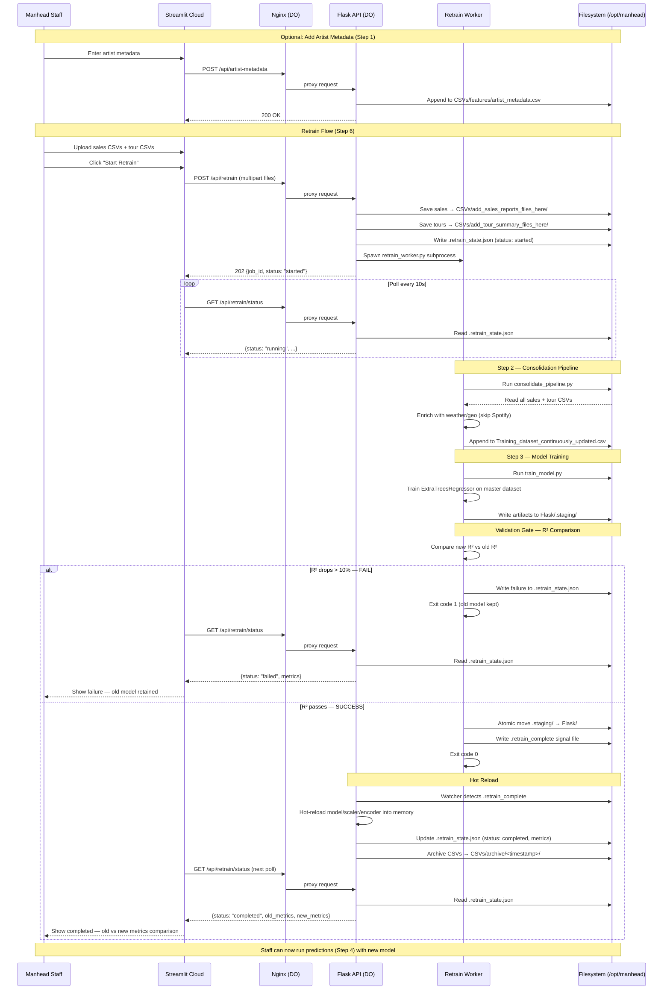

# Retrain Flow — DigitalOcean Droplet

```mermaid
sequenceDiagram
    participant Staff as Manhead Staff
    participant UI as Streamlit Cloud
    participant Nginx as Nginx (DO)
    participant Flask as Flask API (DO)
    participant Worker as Retrain Worker
    participant FS as Filesystem (/opt/manhead)

    Note over Staff,FS: Optional: Add Artist Metadata (Step 1)
    Staff->>UI: Enter artist metadata
    UI->>Nginx: POST /api/artist-metadata
    Nginx->>Flask: proxy request
    Flask->>FS: Append to CSVs/features/artist_metadata.csv
    Flask-->>UI: 200 OK

    Note over Staff,FS: Retrain Flow (Step 6)
    Staff->>UI: Upload sales CSVs + tour CSVs
    Staff->>UI: Click "Start Retrain"
    UI->>Nginx: POST /api/retrain (multipart files)
    Nginx->>Flask: proxy request

    Flask->>FS: Save sales → CSVs/add_sales_reports_files_here/
    Flask->>FS: Save tours → CSVs/add_tour_summary_files_here/
    Flask->>FS: Write .retrain_state.json (status: started)
    Flask->>Worker: Spawn retrain_worker.py subprocess
    Flask-->>UI: 202 {job_id, status: "started"}

    loop Poll every 10s
        UI->>Nginx: GET /api/retrain/status
        Nginx->>Flask: proxy request
        Flask->>FS: Read .retrain_state.json
        Flask-->>UI: {status: "running", ...}
    end

    Note over Worker,FS: Step 2 — Consolidation Pipeline
    Worker->>FS: Run consolidate_pipeline.py
    FS-->>Worker: Read all sales + tour CSVs
    Worker->>Worker: Enrich with weather/geo (skip Spotify)
    Worker->>FS: Append to Training_dataset_continuously_updated.csv

    Note over Worker,FS: Step 3 — Model Training
    Worker->>FS: Run train_model.py
    Worker->>Worker: Train ExtraTreesRegressor on master dataset
    Worker->>FS: Write artifacts to Flask/.staging/

    Note over Worker,FS: Validation Gate — R² Comparison
    Worker->>Worker: Compare new R² vs old R²

    alt R² drops > 10% — FAIL
        Worker->>FS: Write failure to .retrain_state.json
        Worker->>Worker: Exit code 1 (old model kept)
        UI->>Nginx: GET /api/retrain/status
        Nginx->>Flask: proxy request
        Flask->>FS: Read .retrain_state.json
        Flask-->>UI: {status: "failed", metrics}
        UI-->>Staff: Show failure — old model retained
    else R² passes — SUCCESS
        Worker->>FS: Atomic move .staging/ → Flask/
        Worker->>FS: Write .retrain_complete signal file
        Worker->>Worker: Exit code 0

        Note over Flask,FS: Hot Reload
        Flask->>FS: Watcher detects .retrain_complete
        Flask->>Flask: Hot-reload model/scaler/encoder into memory
        Flask->>FS: Update .retrain_state.json (status: completed, metrics)
        Flask->>FS: Archive CSVs → CSVs/archive/<timestamp>/

        UI->>Nginx: GET /api/retrain/status (next poll)
        Nginx->>Flask: proxy request
        Flask->>FS: Read .retrain_state.json
        Flask-->>UI: {status: "completed", old_metrics, new_metrics}
        UI-->>Staff: Show completed — old vs new metrics comparison
    end

    Note over Staff,FS: Staff can now run predictions (Step 4) with new model
```
